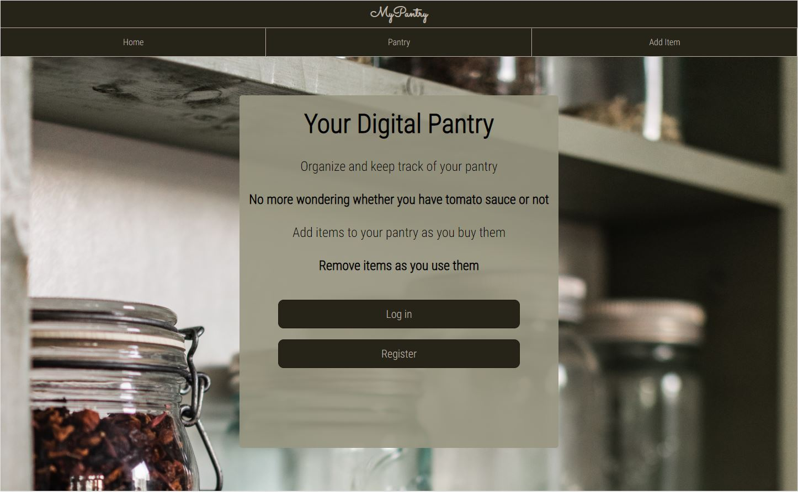
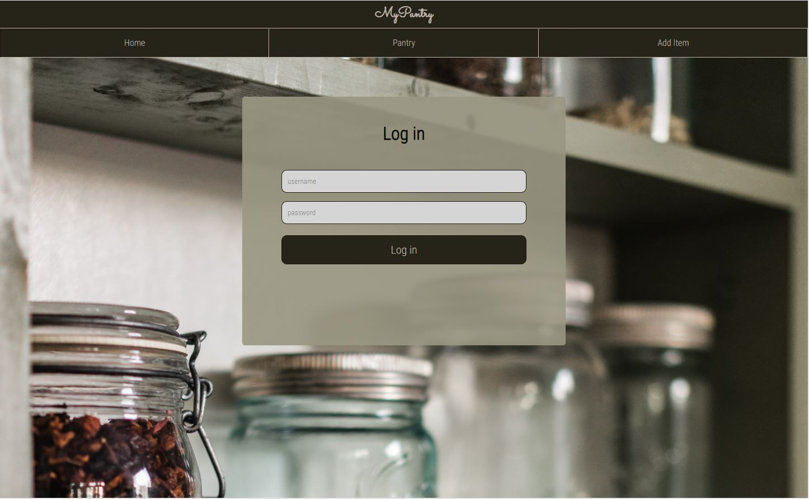
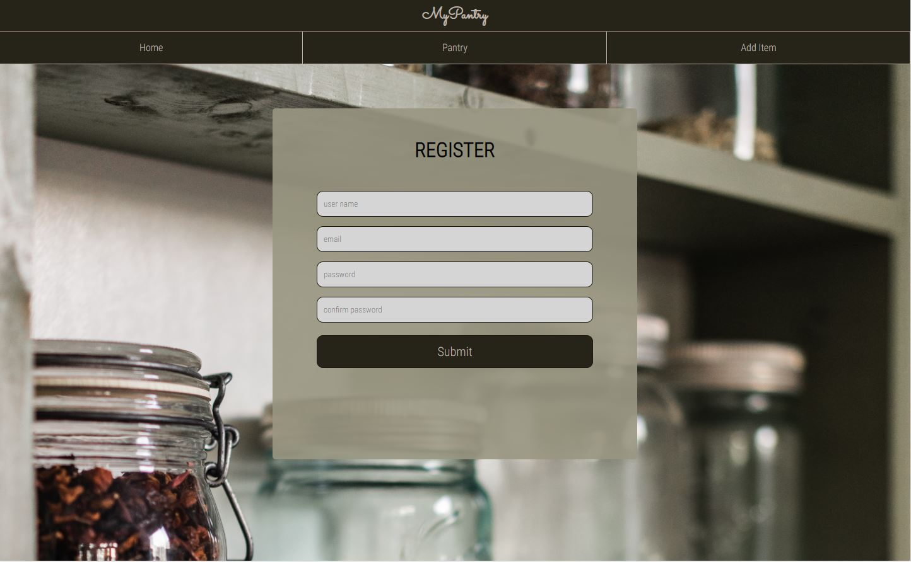
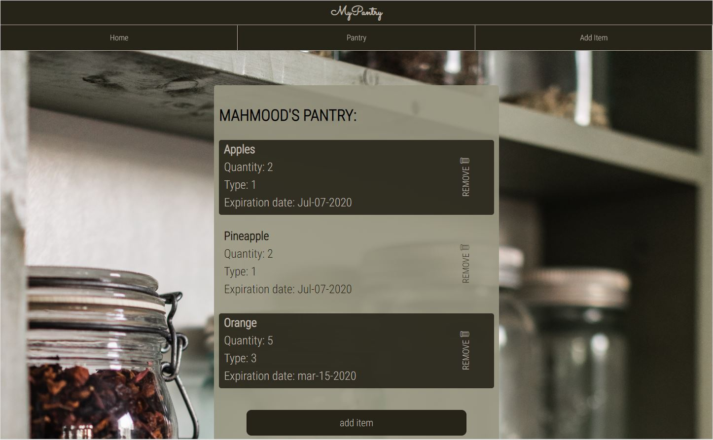
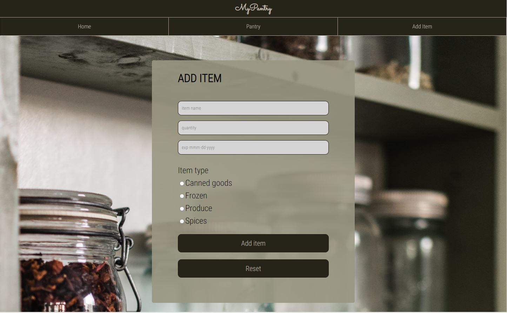

# MyPantry

You can visit the app here
[Live Link](https://my-pantry-lac.vercel.app/) .

## Summary
The app lets the user keep a digital version of their panty.   
User can start by registering an account, then log in with said account.  
User can start adding items to their pantry.   
User can delete items from their pantry.  
User can view their pantry and details about each item.  

## Technologies Used :
1. Javascript
2. Express
3. Node 
4. PostgreSql
5. React
6. HTML5
7. CSS 
8. Heroku for backend deployment
9. Vercel for frontend deployment
10. GitHub for repository management

## Screenshots

Developed by Mahmood Nihad